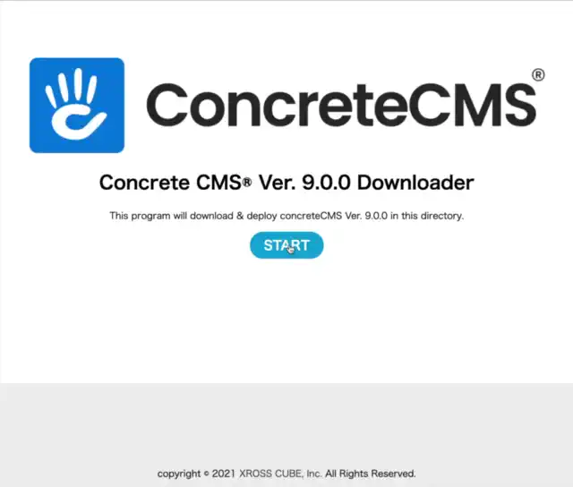

# Concrete CMS® Simple Downloader
*Concrete CMS® One-file downloader*

Download and deploy Concrete CMS®.

Plesae use [8.5 branch](https://github.com/tao-s/c5downloader/tree/master) if you want to use Ver. 8.5.x.

## How to use
- Upload "c5downloader.php" to install directory in the web server.
- Access uploaded script on your browser. 
 ex.
 https://example.com/c5downloader.php

## Where can I use this?
We confirmed executable this script at hosting service below list,

* [Windows Azure Website](https://azure.microsoft.com/en-us/services/app-service/web/)
* Zenlogick

*Please send PR if you know where can use this script*
